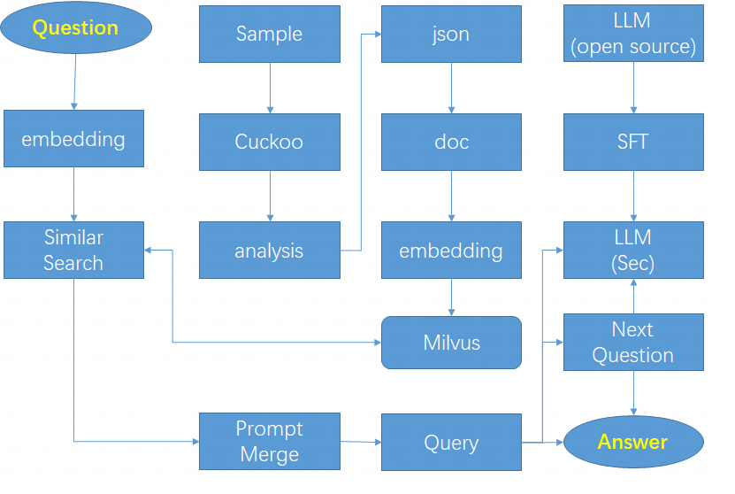
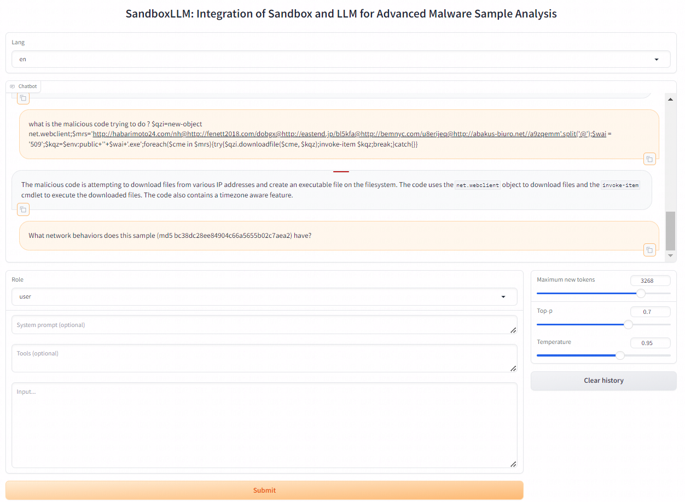
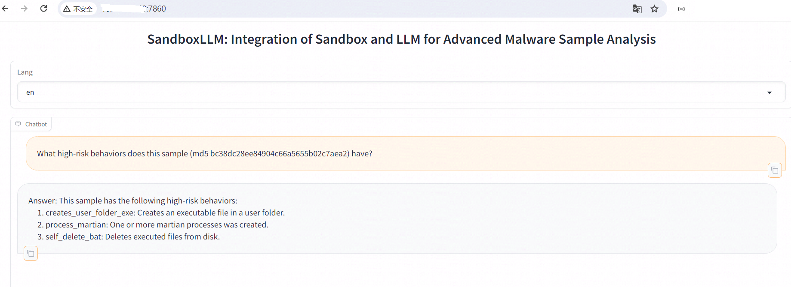
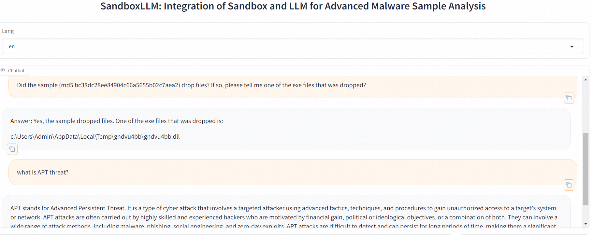
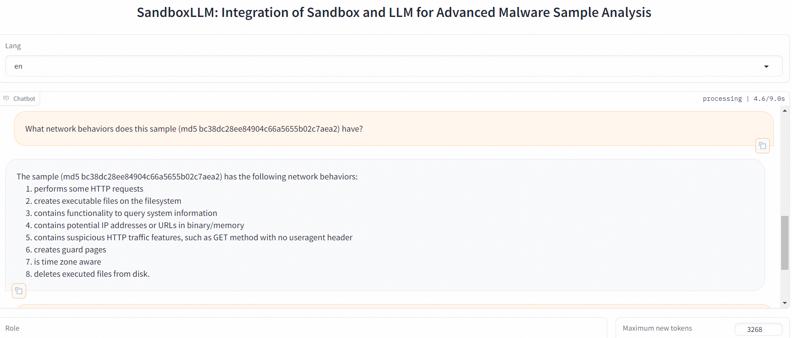
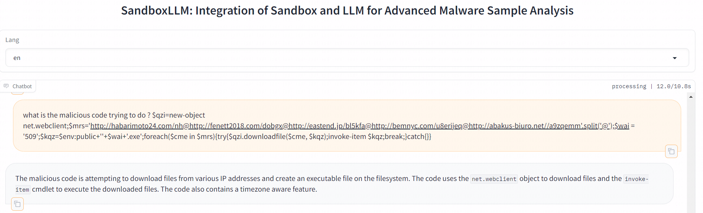

# SandboxLLM
Leveraging the LLM (Large Language Model) with Sandbox technology by SFT (supervised fine tuning) and RAG (Retrieval Augmented Generation) to deliver software analysis reasoning capabilities along with precise Natural Language Processing (NLP) query results.

please refer to here for the demo code and output : [sandboxllm_rag_workflow_demo](llm/sandboxllm_rag_workflow_demo.ipynb)

# Architecture

1. LLM supervised fine-tuning process
- construct security domain knowledge dataset (e.g., APT knowledge) and malware analysis pattern dataset (e.g., conclusions and evidential reasoning derived from manual sample analysis by security researchers). And the open-source LLM is selected as base model for SFT since it has good basic capability with long token support for English and Chinese language. So the LLM can be enabled to acquire knowledge and analytical methods specific to the security domain.
2. Sandbox output report data processing process
- Firstly, user uploads sample to the sandbox, and the sandbox analyzes the sample then outputs the result in JSON format.
- Secondly, the JSON-formatted data is converted to NLP text format which LLM can understand more easily.
- Finally we use overlapping windows to cut long text for vectorization and inserting data into vector database.
3. User query inference process
- RAG based LLM querying.
- It retrieve text from vector database by user query vectorization then merge the text with user query by prompt to get response from LLM.
- And the sample source code will be appended to the prompt if the sample is script, so LLM can read the source code for better analysis. 

# Sample Analysis Examples

A. SandboxLLM UI demo

B. Sample risk behavior analysis by LLM

C. Sample behavior analysis and security knowledge Q&A

D. Sample network behavior analysis by LLM

E. Malicious code analysis by LLM

# Steps to run 

1. Deploy sandbox Cuckoo as the steps [here](sandbox/readme.md)
2. Deploy and run LLM as the steps [here](llm/readme.md)

# License
This repository is licensed under the MIT License.

Please follow other model/project licenses to use the corresponding model weights and other open source project : [ChatGLM3](https://github.com/THUDM/ChatGLM3/blob/main/LICENSE), [Qwen](https://github.com/QwenLM/Qwen/blob/main/Tongyi%20Qianwen%20LICENSE%20AGREEMENT), [LLaMA-Factory](https://github.com/hiyouga/LLaMA-Factory)

